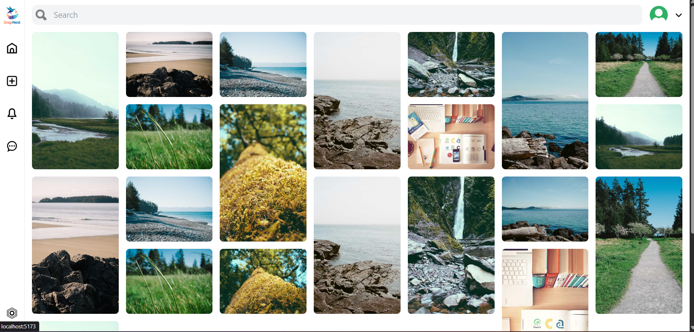
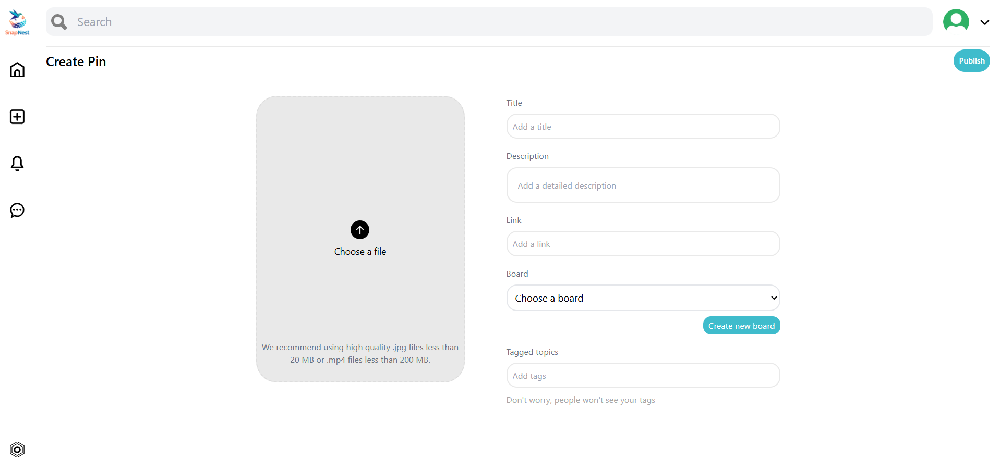
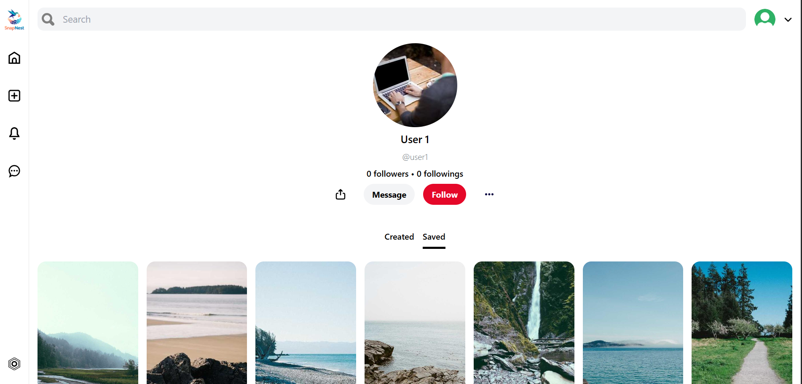
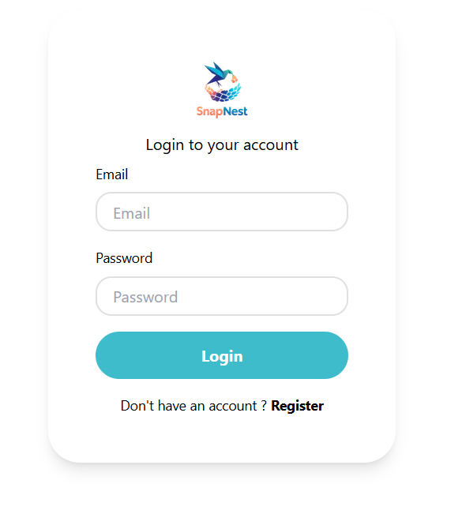
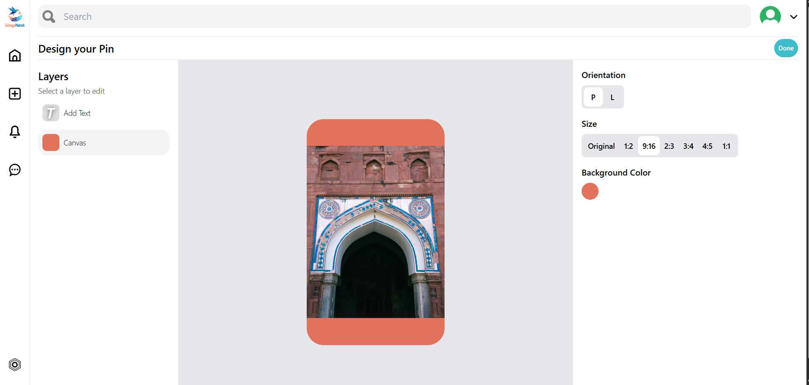
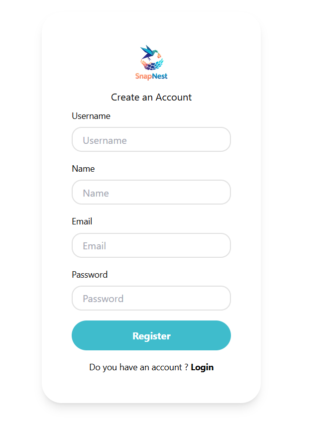

# 📌 SnapNest

SnapNest is a full-stack image-sharing platform inspired by the concept of visual discovery. It allows users to post, save, and explore creative content through a board-pin model — designed with an intuitive interface and rich feature set.

---

## 🖼️ Demo & Screenshots

| Home Page | Create Pin | Profile Page |
| :---: | :---: | :---: |
|  |  |  |
| **Login Page** | **Image Editor** | **Register Page** |
|  |  |  |
| **Post View** | | |
|  | | |

---

## 🔧 Tech Stack

### Frontend:
- ⚛️ React + Vite
- 💨 TailwindCSS
- 🧠 Zustand (State Management)
- 🔀 React Router
- 📷 ImageKit.io (Image CDN)

### Backend:
- 🔙 Node.js + Express.js
- 🧬 MongoDB (via Mongoose)
- 🔑 JWT (Authentication)
- 🖼️ Sharp (Image optimization)
- ☁️ ImageKit API

---

## 🌟 Features

- 🔐 User Authentication (Register/Login)
- 📌 Upload Pins (Images or Videos)
- 📝 Title, Description, Tags, and Board Assignments
- 🖌️ Canvas-based Editor (Text overlay, Resize, Rotate)
- 💬 Commenting on Pins
- ❤️ Like, Save, Follow
- 🔍 Search Pins
- 👤 Profile Page (Created/Saved Pins)
- 🌓 Clean UI (Dark/Light ready)

---

## 📁 Project Structure

```bash
.
├── backend/                # Express + MongoDB API
│   ├── controllers/
│   ├── middlewares/
│   ├── models/
│   ├── routes/
│   ├── utils/
│   └── index.js
├── client/                 # React frontend
│   ├── components/
│   ├── pages/
│   ├── utils/
│   ├── App.jsx
│   └── main.jsx


```
## 🚀 Getting Started Prerequisites

✅ Node.js (v18+)
✅ MongoDB
✅ ImageKit.io account

## 🛠️ Installation & Running

### Clone the repository
git clone https://github.com/your-username/snapnest.git
cd snapnest

### Install backend
cd backend
npm install

### Install frontend
cd ../client
npm install
Run the Project

### Backend
cd backend
npm run dev

### Frontend
cd ../client
npm run dev

## 🌍 Environment Variables
In /backend/.env, create and set:

PORT=5000
MONGO_URI=your_mongodb_url
JWT_SECRET=your_secret
IMAGEKIT_PUBLIC_KEY=your_public_key
IMAGEKIT_PRIVATE_KEY=your_private_key
IMAGEKIT_URL_ENDPOINT=https://ik.imagekit.io/your_imagekit_id
## 👨‍💻 Author
Made with ❤️ by @heyrajaman

## 📄 License
This project is licensed under the ISC License.

## 🤝 Contribute
Feel free to fork the repo, raise issues, and submit PRs. Feedback and improvements are always welcome!
